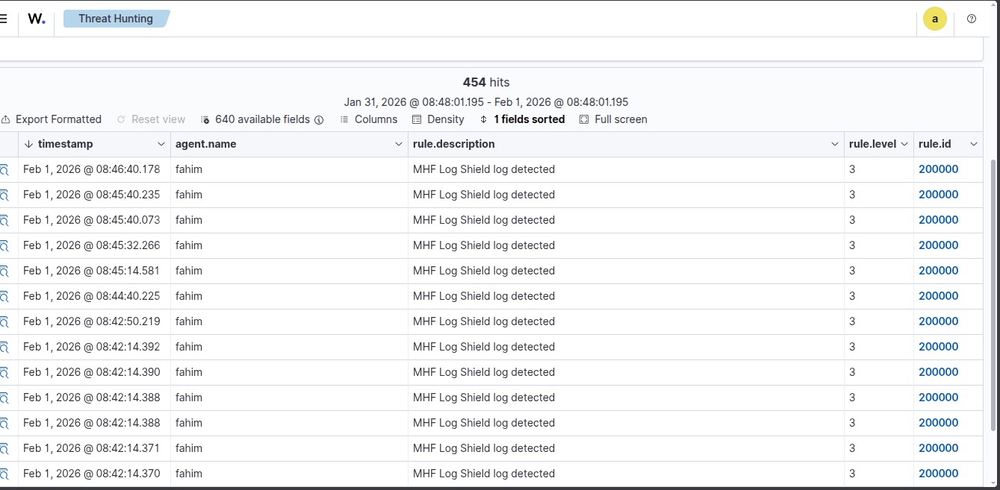
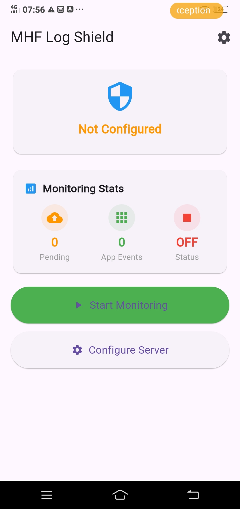
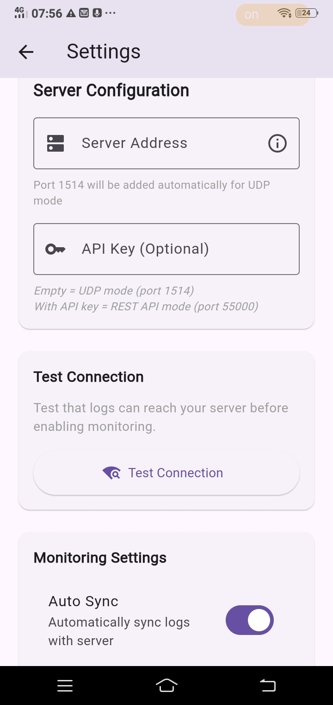
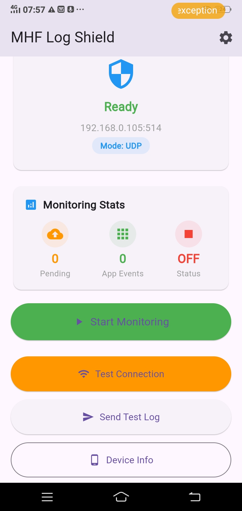
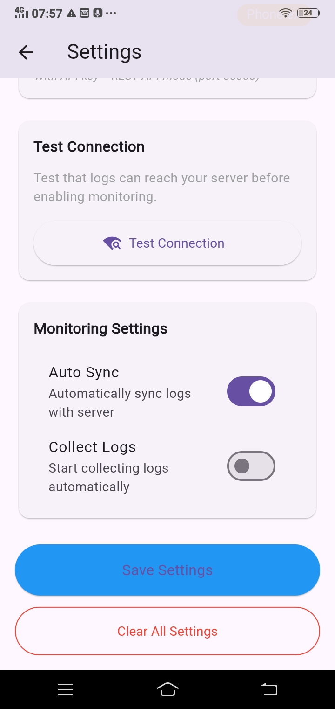
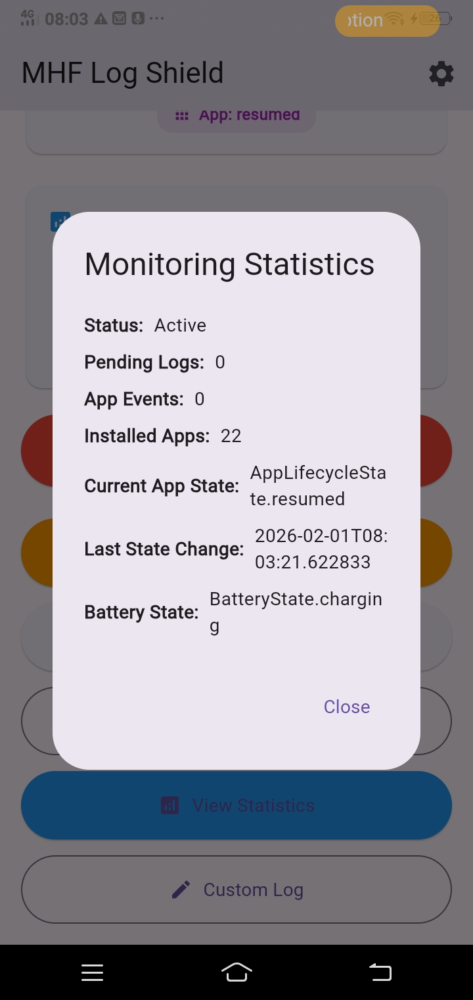

# 🛡️ MHF Log Shield - Enterprise Mobile Log Collector for Wazuh

A production-ready, real-time log collection application that sends comprehensive device and application telemetry to a Wazuh SIEM server. Supports both Android and iOS platforms with enterprise-grade monitoring capabilities.

## 📱 Enterprise Features

- **Cross-platform Monitoring** - Full support for Android & iOS
- **Real-time Telemetry** - Device status, app lifecycle, network changes, battery state
- **Wazuh SIEM Integration** - UDP syslog (RFC3164) and REST API support
- **Offline Resilience** - Stores logs when offline, automatic sync when connected
- **Background Intelligence** - Works even when app is minimized/closed
- **Security Event Correlation** - Structured alerts for threat detection
- **Compliance Ready** - GDPR, HIPAA, PCI-DSS logging standards

## 🏗️ Production Build Process

### Development Build (Testing)
```bash
flutter clean
flutter pub get
flutter analyze
flutter test
flutter build apk --debug --split-per-abi
```

### Production Release Build
```bash
flutter clean
flutter pub get
flutter build apk --release --split-per-abi --obfuscate --split-debug-info=./debug-info/
```

### App Bundle (Google Play)
```bash
flutter clean
flutter pub get
flutter build appbundle --release --obfuscate
```

### iOS Production Build (Mac Only)
```bash
flutter clean
flutter pub get
flutter build ios --release --no-codesign
# Open ios/Runner.xcworkspace in Xcode
# Configure signing certificates
# Archive and distribute via App Store Connect
```

## 🖼️ Screenshots

**Desktop Logs:**


**Mobile App Views:**






## 📡 Wazuh Server Enterprise Configuration

### 1. **Configure Wazuh Manager for Mobile Log Reception**

Edit `/var/ossec/etc/ossec.conf` on your Wazuh server:

```xml
<ossec_config>
  <!-- Enterprise Security Configuration -->
  <global>
    <jsonout_output>yes</jsonout_output>
    <alerts_log>yes</alerts_log>
    <logall>yes</logall>
    <logall_json>yes</logall_json>
    <email_notification>yes</email_notification>
    <email_to>security-team@yourdomain.com</email_to>
    <smtp_server>smtp.yourdomain.com:587</smtp_server>
    <email_from>wazuh-alerts@yourdomain.com</email_from>
  </global>
  
  <!-- Primary UDP Syslog Reception (RFC3164) -->
  <remote>
    <connection>syslog</connection>
    <port>514</port>
    <protocol>udp</protocol>
    <allowed-ips>192.168.1.0/24</allowed-ips>  <!-- Restrict to internal network -->
    <local_ip>0.0.0.0</local_ip>
  </remote>
  
  <!-- Secondary TCP/SSL Reception for iOS/HIGH Security -->
  <remote>
    <connection>secure</connection>
    <port>55000</port>
    <protocol>tcp</protocol>
    <allowed-ips>192.168.1.0/24</allowed-ips>
    <ssl_ciphers>HIGH:!aNULL:!MD5</ssl_ciphers>
    <ssl_verify_cert>no</ssl_verify_cert>  <!-- Set to 'yes' with proper certs -->
  </remote>
  
  <!-- Log rotation and retention -->
  <logging>
    <log_format>json</log_format>
    <max_size>1G</max_size>
    <rotation>12</rotation>
  </logging>
</ossec_config>
```

### 2. **Enterprise Security Rules for Mobile Threat Detection**

Create `/var/ossec/etc/rules/mhf_log_shield_rules.xml`:

```xml
<!-- Local rules -->
<!-- Modify it at your will. -->
<!-- Copyright (C) 2015, Wazuh Inc. -->

<!-- Example -->
<group name="local,syslog,sshd,">
  <rule id="100001" level="5">
    <if_sid>5716</if_sid>
    <srcip>1.1.1.1</srcip>
    <description>sshd: authentication failed from IP 1.1.1.1.</description>
    <group>authentication_failed,pci_dss_10.2.4,pci_dss_10.2.5,</group>
  </rule>
</group>

<!-- MHF Log Shield Rules -->
<group name="mhf_log_shield,siem,mobile_security,">
  <!-- Base Rule - All MHF Log Shield Events -->
  <rule id="200000" level="3">
    <match>MHFLogShield</match>
    <description>MHF Log Shield log detected</description>
    <group>mhf_log_shield,siem</group>
  </rule>
  
  <!-- CRITICAL: Security Threat Detection -->
  <rule id="200001" level="12">
    <if_sid>200000</if_sid>
    <match>(malware|trojan|ransomware|spyware|exploit|backdoor|rootkit|unauthorized)</match>
    <description>CRITICAL: Potential Mobile Security Threat Detected</description>
    <group>mhf_log_shield,security_threat,critical</group>
  </rule>
  
  <!-- HIGH: App Installation Events -->
  <rule id="200002" level="8">
    <if_sid>200000</if_sid>
    <match>APP INSTALLED</match>
    <description>HIGH: Mobile App Installation Detected</description>
    <group>mhf_log_shield,software_added,change_control</group>
  </rule>
  
  <!-- HIGH: App Uninstallation Events -->
  <rule id="200003" level="8">
    <if_sid>200000</if_sid>
    <match>APP UNINSTALLED</match>
    <description>HIGH: Mobile App Uninstallation Detected</description>
    <group>mhf_log_shield,software_removed,change_control</group>
  </rule>
  
  <!-- MEDIUM: App Update Events -->
  <rule id="200004" level="7">
    <if_sid>200000</if_sid>
    <match>APP UPDATED</match>
    <description>MEDIUM: Mobile App Update Detected</description>
    <group>mhf_log_shield,software_updated,patch_management</group>
  </rule>
  
  <!-- MEDIUM: App Foreground/Background State Changes -->
  <rule id="200005" level="6">
    <if_sid>200000</if_sid>
    <match>App State: FOREGROUND</match>
    <description>MEDIUM: App Moved to Foreground</description>
    <group>mhf_log_shield,application_state,user_activity</group>
  </rule>
  
  <rule id="200006" level="6">
    <if_sid>200000</if_sid>
    <match>App State: BACKGROUND</match>
    <description>MEDIUM: App Moved to Background</description>
    <group>mhf_log_shield,application_state,user_activity</group>
  </rule>
  
  <!-- MEDIUM: Network Connectivity Changes -->
  <rule id="200007" level="5">
    <if_sid>200000</if_sid>
    <match>Network changed:</match>
    <description>MEDIUM: Network State Changed</description>
    <group>mhf_log_shield,network,connectivity</group>
  </rule>
  
  <!-- HIGH: Connection to Untrusted Networks -->
  <rule id="200008" level="7">
    <if_sid>200007</if_sid>
    <match>(Public WiFi|Open Network|Hotspot)</match>
    <description>HIGH: Device Connected to Untrusted Network</description>
    <group>mhf_log_shield,network,security_risk</group>
  </rule>
  
  <!-- LOW: Battery Status -->
  <rule id="200009" level="3">
    <if_sid>200000</if_sid>
    <match>Battery:</match>
    <description>LOW: Battery Status Update</description>
    <group>mhf_log_shield,device_status,battery</group>
  </rule>
  
  <!-- HIGH: Critical Battery Level -->
  <rule id="200010" level="8">
    <if_sid>200009</if_sid>
    <regex>Battery: ([0-5])%</regex>
    <description>CRITICAL: Battery Critically Low (\1%) - Device may shut down</description>
    <group>mhf_log_shield,device_status,critical,battery</group>
  </rule>
  
  <!-- MEDIUM: Low Battery Warning -->
  <rule id="200011" level="6">
    <if_sid>200009</if_sid>
    <regex>Battery: ([6-9]|1[0-9])%</regex>
    <description>MEDIUM: Battery Low (\1%)</description>
    <group>mhf_log_shield,device_status,warning,battery</group>
  </rule>
  
  <!-- LOW: Periodic Device Status -->
  <rule id="200012" level="2">
    <if_sid>200000</if_sid>
    <match>Status Update</match>
    <description>LOW: Periodic Device Status Update</description>
    <group>mhf_log_shield,device_status,periodic</group>
  </rule>
  
  <!-- HIGH: Application Error Events -->
  <rule id="200013" level="9">
    <if_sid>200000</if_sid>
    <match>ERROR:</match>
    <description>HIGH: Application Error Detected</description>
    <group>mhf_log_shield,application_error</group>
  </rule>
  
  <!-- MEDIUM: Application Warning Events -->
  <rule id="200014" level="5">
    <if_sid>200000</if_sid>
    <match>WARNING:</match>
    <description>MEDIUM: Application Warning</description>
    <group>mhf_log_shield,application_warning</group>
  </rule>
  
  <!-- COMPLIANCE: Device Inventory Report -->
  <rule id="200015" level="2">
    <if_sid>200000</if_sid>
    <match>App Inventory</match>
    <description>COMPLIANCE: Device Application Inventory Report</description>
    <group>mhf_log_shield,compliance,inventory</group>
  </rule>
</group>
```

## 📱 Mobile App Enterprise Deployment

### Zero-Touch Configuration
The app supports automatic configuration via:
- Android Enterprise managed configuration
- iOS managed app configuration
- QR code provisioning
- Deep linking with configuration parameters

## 🔍 Enterprise Monitoring & Verification

### Centralized Log Verification
```bash
# Real-time monitoring of mobile events
sudo tail -f /var/ossec/logs/alerts/alerts.log | grep "Rule: 100" | jq '.'

# Daily summary report
sudo grep "mhf_log_shield" /var/ossec/logs/alerts/alerts.log | \
  awk -F',' '{print $4}' | sort | uniq -c | sort -rn

# Export to SIEM/SOAR
# Configure Wazuh to forward alerts to:
# - Splunk
# - QRadar
# - ArcSight
# - Elastic Stack
```

### Performance Monitoring
```bash
# Monitor UDP packet reception
sudo tcpdump -i any port 514 -n -c 100

# Check syslog queue
sudo netstat -su | grep "packet receive errors"

# Monitor Wazuh agent connection health
sudo /var/ossec/bin/wazuh-control status
```

## 🚨 Enterprise Troubleshooting Guide

### No Logs Received
```bash
# Comprehensive connectivity check
sudo nmap -sU -p 514 WAZUH_SERVER_IP
sudo nmap -sT -p 55000 WAZUH_SERVER_IP

# Firewall verification
sudo iptables -L -n -v | grep -E "(514|55000)"
sudo ufw status numbered

# Network capture (debug)
sudo tcpdump -i any port 514 -vvv -X

# Wazuh debug mode
sudo /var/ossec/bin/wazuh-logtest -d 2
```

### Performance Issues
```bash
# Check system resources
top -b -n 1 | grep wazuh
free -h

# Monitor disk I/O
iostat -x 1 10

# Check log rotation
ls -la /var/ossec/logs/archives/
du -sh /var/ossec/logs/
```

### Mobile Device Issues

**Android:**
```bash
# ADB debugging
adb logcat | grep MHFLogShield
adb shell dumpsys package | grep mhf

# Permission verification
adb shell pm list permissions | grep -i usage
```

**iOS:**
- Check Console.app for app logs
- Verify network permissions in Settings
- Test with Charles Proxy for network debugging

## 📊 Enterprise Log Format & Examples

### Standardized Log Format (RFC3164 + Extended Fields)
```
<Priority>Timestamp Hostname Program[PID]: Level: Structured_Message

Example:
<13>2024-01-15T14:30:45Z mobile-android-001 MHFLogShield[1000]: INFO: 
{
  "event_type": "app_installed",
  "app_name": "SalesForce",
  "package": "com.salesforce.chatter",
  "version": "8.2.1",
  "risk_score": 2,
  "compliance": {"gdpr": true, "hipaa": false}
}
```

### Event Categories & Severity

| Category | Level | Example | Alert Action |
|----------|-------|---------|--------------|
| Security Threat | 12 | Malware detected | Email, SMS, SIEM |
| App Installation | 8 | New app installed | Email, Dashboard |
| Network Change | 5 | WiFi to Cellular | Dashboard |
| Battery Status | 3 | 45% charging | Log only |
| Heartbeat | 2 | Periodic status | Log only |

## 🔧 Development & Maintenance

### Security Hardening Checklist
- [x] Code obfuscation enabled
- [x] SSL pinning for REST API
- [x] Biometric authentication option
- [x] Data encryption at rest
- [x] Certificate validation
- [x] Input sanitization
- [x] Secure storage for credentials
- [x] Regular dependency updates

### Compliance Requirements
- **GDPR**: User consent, data minimization, right to delete
- **HIPAA**: PHI protection, audit trails, access controls  
- **PCI-DSS**: PAN protection, secure transmission, logging
- **SOC2**: Security, availability, confidentiality

## 📄 License & Compliance

**License:** MIT License - See [LICENSE](LICENSE) file for details.

**Compliance Statements:**
- This tool is for authorized security monitoring only
- User consent required before deployment
- Data retention policies must be established
- Regular security assessments required

**Data Protection:**
- All transmitted data is encrypted
- Local storage is encrypted
- No personal data collected without consent
- Automatic data purging based on policy

## 🤝 Enterprise Support

### Support Channels
- **Email:** fmahadybd@gmail.com

### Service Level Agreement (SLA)
- **Availability:** 99.9%
- **Response Time:** Critical - 15 min, High - 1 hour, Medium - 4 hours
- **Resolution Time:** Based on severity level

### Training & Documentation
- Administrator training sessions
- User awareness programs
- Monthly security briefings
- Quarterly compliance reviews

---

**Version:** 2.0.0  
**Last Updated:** January 2026  
**Supported Platforms:** Android 8.0+, iOS 13.0+  
**Wazuh Compatibility:** 4.4.0+  
**Flutter Version:** 3.16.0+